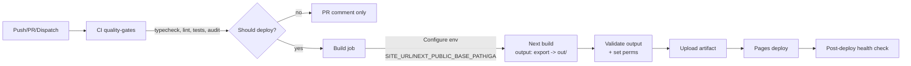

# Technical Design Document (TDD) — Tech Tavern Website

Version: 1.0
Status: Current implementation overview + improvements roadmap

## 1. Project Overview

- Purpose and scope: Static marketing site and MDX blog for Tech Tavern, LLC, built with Next.js App Router and exported as a fully static site suitable for GitHub Pages. Scope includes a branded landing page, Articles index, article detail pages with SEO, sitemap and RSS, optional GA, and a lightweight authoring workflow using MDX in Git. No runtime server.
- Key stakeholders and target audience: Tech Tavern engineering/product teams; end users are prospective clients and partners. Content readers include search engines and aggregators via sitemap/RSS.
- High‑level architecture summary: App Router pages under `src/app/` render sections/components from `src/components/**`. Blog content is sourced from filesystem MDX under `content/articles/`, validated and processed in `src/lib/posts.ts`. Static export is performed by Next.js (`output: 'export'`) with environment‑aware base pathing for GitHub Pages. SEO is covered via Next metadata, JSON‑LD, sitemap, and RSS.

## 2. System Architecture

- Component hierarchy and relationships:
  - App shell: `src/app/layout.tsx` provides global metadata, CSP, fonts/styles, optional GA, and the homepage navigation.
  - Home page: `src/app/page.tsx` composes sections (`Hero`, `Info`, `Mission`, `Services`, `Profile`, `Contact`) and a `Footer`.
  - Articles:
    - Index: `src/app/articles/page.tsx` renders cards for posts from `getAllPosts()`.
    - Detail: `src/app/articles/[year]/[month]/[day]/[slug]/page.tsx` compiles the MDX and renders article content using site MDX components; `head.tsx` injects JSON‑LD for the article.
  - Syndication: `src/app/sitemap.ts` and `src/app/rss.xml/route.ts` generate sitemap and RSS using posts.
  - Lib: `src/lib/**` handles env validation, site/meta helpers, posts processing, and SEO JSON‑LD builders.

- Data flow (content to pages):

```mermaid
flowchart TD
  A[MDX files
  content/articles/*.mdx] -->|gray-matter| B[Frontmatter + Content]
  B -->|Zod validation| C[PostMeta objects
  (derived fields)]
  C --> D[Articles index /articles]
  C --> E[Static params for article routes]
  E --> F[Article page
  compileMDX + MDX components]
  C --> G[Sitemap /sitemap.xml]
  C --> H[RSS /rss.xml]
```

- Static site generation strategy:
  - The app uses the Next.js App Router with full static export in production (`next.config.ts: output: 'export', trailingSlash: true`).
  - Article routes are prebuilt via `generateStaticParams()` in `src/app/articles/[year]/[month]/[day]/[slug]/page.tsx`, using `getAllPosts()` to enumerate all MDX files.
  - Sitemap and RSS are statically generated (with `export const dynamic = 'force-static'`) and written into the static output.
  - Images are set to `unoptimized: true` to maximize compatibility with static export and GitHub Pages.
  - Base path handling for staging (repo subdirectory) vs production is done via environment and helpers, ensuring correct href/src on static hosting.

- Build and deployment pipeline architecture:



## 3. Technology Stack

- Framework and libraries:
  - Next.js 15 App Router with static export; React 19; MDX via `@next/mdx` and `next-mdx-remote/rsc` for server-side compilation.
  - Styling: Tailwind CSS v4 using CSS `@import` and `@theme` in `globals.css`.
  - Content processing: `gray-matter`, `fast-glob`, `zod` for frontmatter validation.
  - SEO: Next Metadata API, custom JSON‑LD builders, sitemap, and RSS utilities.
  - Icons: `lucide-react` for navigation.

- Dev/test dependencies:
  - TypeScript (strict), ESLint (Next core-web-vitals + TS), Jest + RTL for unit tests, PostCSS + Tailwind.

- Build tools and configuration:
  - `next.config.ts` applies MDX, export mode, `unoptimized` images, `pageExtensions` incl. `mdx`, and aliases `zod=false` on client to honor CSP. MDX options are centralized in `src/lib/mdx-options.ts` and imported by both the Next MDX loader and runtime `compileMDX`.
  - `eslint.config.mjs` flat config with Next presets and ignores.
  - `jest.config.js` via `next/jest`, JSDOM environment, module aliases for `@/*`.

## 4. File Structure and Organization

- Directory structure:
  - `src/app/`: App Router entries (`layout.tsx`, `page.tsx`, `articles/*`, `rss.xml/route.ts`, `sitemap.ts`, `globals.css`).
  - `src/components/`: `sections/*` for homepage sections, `ui/*` for shared UI (Navigation, Footer, MDXImage, GoogleAnalytics, SvgDivider).
  - `src/lib/`: `env.ts` (Zod validation), `site.ts` (client‑safe constants), `site.server.ts` (base URL + basePath helpers), `posts.ts` (content loader and schema), `seo.ts` (JSON‑LD builders).
  - `content/articles/`: MDX posts with `YYYY-MM-DD-slug.mdx` naming and required frontmatter.
  - `public/`: static assets (local fonts and images, favicons/manifest).
  - `.github/workflows/deploy.yml`: CI gates, build, and GitHub Pages deploy.
  - `documentation/PRD.md`: Product Requirements Document; this TDD: `documentation/TDD.md`.

- Naming conventions:
  - Components: PascalCase.
  - Utilities: lowerCamelCase or kebab for files; modules under `src/lib/` are lowerCamelCase.
  - Routes under `src/app/`: lowercase semantic paths; article detail paths in nested segments.

- Module organization patterns:
  - Server‑only helpers live in `*.server.ts` and are imported from server components/routes.
  - MDX rendering is server‑side using `compileMDX`, with MDX component mappings from `src/mdx-components.tsx`.

## 5. Data Management

- Content structure and sources:
  - MDX posts in `content/articles/` with required frontmatter: `title`, `date (yyyy-mm-dd)`, `slug`. Optional: `excerpt`, `tags`, `featuredImage`, `ogTitle`, `ogDescription`, `ogImage`, `canonicalUrl`, `draft`.
  - Filename convention: `YYYY-MM-DD-slug.mdx`. Derived path for routing: `/articles/YYYY/MM/DD/slug/`.

- Static data handling:
  - `src/lib/posts.ts` reads MDX, validates via Zod (`FrontmatterSchema`), derives `year/month/day`, `url`, and `readingTimeMinutes` (~200 wpm). Drafts are filtered out.
  - Images in frontmatter are normalized using `withBasePath` so staging base pathing is correct.

- Asset management strategy:
  - Local fonts via `@font-face` in `globals.css` with `font-display: swap`.
  - Images in `public/images/**`; hero images are preloaded via `<link rel="preload">` in the root layout and used as responsive backgrounds via CSS.
  - Next Image is used (unoptimized) when local assets have known dimensions; fall back to `` for external or dimensionless images.

## 6. Build and Deployment

- GitHub Actions workflow analysis (`.github/workflows/deploy.yml`):
  - Triggers: push to `main`, PRs to `main`, manual dispatch with `environment` input.
  - Jobs:
    - `quality-gates`: checkout, Node 20, cache, `npm ci`, typecheck, lint, optional Jest, `npm audit`, optional Snyk; determines if deploy proceeds and sets environment.
    - `build`: restores caches, installs deps, configures `SITE_URL` and `NEXT_PUBLIC_BASE_PATH` based on custom domain or default Pages domain; sets optional `NEXT_PUBLIC_GA_ID`; runs `npm run build` (static export to `out/`); removes sourcemaps in production; validates and uploads build; prepares Pages artifacts.
    - `deploy`: `actions/deploy-pages@v4`, prints summary, runs a basic health check.
    - `pr-comment`: comments build summary on PRs.

- Static site generation process:
  - `next build` with `output: 'export'` writes content into `out/`. Trailing slashes ensure Pages serves directory indexes.
  - `NEXT_PUBLIC_BASE_PATH` and `SITE_URL` are populated by CI to support staging (repository subdirectory) vs production (root or custom domain).

- GitHub Pages configuration and constraints:
  - `CNAME` is present with custom domain `www.tech-tavern.com`.
  - Static export requires `images.unoptimized = true` and no server APIs.
  - CSP and external images: current `img-src` is restricted; external MDX images will be blocked unless CSP is adjusted (see Recommendations).

## 7. Development Workflow

- Local development setup:
  - Node 20+, `npm install`, `npm run dev`.
  - On Windows + WSL use `win-npm` wrapper (documented in README) for reliable file watching.
  - Optional `.env.local` can define `SITE_URL` for absolute links preview.

- Testing strategies:
  - Jest + React Testing Library present; targeted unit tests cover env parsing, site URL helpers, SEO JSON‑LD builders, frontmatter schema, posts integration, and `MDXImage` behavior.
  - CI executes tests if Jest is available; currently configured and passing locally.

- Code quality tools and processes:
  - ESLint (Next + TS rules), TypeScript strict mode, security audit via `npm audit`. Optional Snyk if token present.

## 8. Performance and Optimization

- Current optimization strategies:
  - Full static export; server components by default in App Router pages; minimal client components (Navigation, GA, MDXImage).
  - Local fonts with `swap`; hero image preloads and responsive background images; Tailwind v4.
  - CSP enforcement aided by aliasing `zod=false` client‑side.

- Bundle analysis and code splitting:
  - No bundle analyzer configured. Code largely server‑rendered with minimal client interactivity; `Navigation`/`GoogleAnalytics`/`MDXImage` are client components.

- SEO and accessibility considerations:
  - Next Metadata API for OpenGraph/Twitter; absolute URLs via `getBaseUrl()`; canonical alternates on pages.
  - JSON‑LD for `Organization` and per‑article `Article` schema.
  - Sitemap and RSS provide discoverability for bots.
  - MDX headings are slugged and autolinked; external links get safe `rel` attributes; homepage and articles pages include accessible navigation and focusable elements.

## Design Analysis and Recommendations

### Architecture Analysis

- SOLID/DRY observations:
  - MDX plugin configuration is centralized in `src/lib/mdx-options.ts` and used by both `next.config.ts` (via `@next/mdx`) and the article page's `compileMDX`, eliminating drift risk.
  - Critical CSS in `layout.tsx` has been trimmed; `.bg-hero` styles live solely in `globals.css` to avoid duplication and drift.
  - Header/Nav reuse: Implemented via `Header` component variants. Home uses the `Navigation` client component through `<Header variant="home" />`; interior pages use `<Header variant="interior" />`. This removes duplication while preserving UX differences.
  - CSP currently allows only GA/Tag Manager for `img-src`. External images embedded via MDX will be blocked. This is a deliberate restriction, but it conflicts with the MDXImage fallback capability for external sources if authors ever use them.

### Specific Recommendations

1) MDX configuration centralization — Implemented
- Status: Implemented (centralized configuration now in use).
- Current State: MDX options are centralized in `src/lib/mdx-options.ts`, exporting `remarkPlugins`, `rehypePlugins`, and a typed `mdxOptions` object. These options are imported by `next.config.ts` (for `@next/mdx`) and by the article page when calling `compileMDX`.
- Rationale: Ensures DRY config and consistent rendering between the Next MDX loader and ad‑hoc compilation paths.
- Impact: No behavioral change; reduces maintenance overhead and eliminates configuration drift risk.
- Follow‑up: Additional MDX/rehype plugins (e.g., external link handling) should be added only in this module.

2) Consolidate critical CSS and global styles — Implemented
- Status: Implemented (inline duplication removed; globals own background rules).
- Current State: The inline critical CSS block in `src/app/layout.tsx` has been removed. Reusable utilities (`.glass`, `.gradient-brand`) and background utilities (`.bg-hero`) are defined once in `src/app/globals.css`. Tailwind utilities handle positioning, spacing, and typography.
- Rationale: Reduces duplication and avoids style drift; improves maintainability.
- Impact: No visual change expected; relies on existing global CSS and Tailwind utilities. Preload hints for hero images remain.
- Follow‑up: If needed later, introduce a generated `critical.css` for above‑the‑fold styles instead of inline blocks.

3) Header/Nav reuse with variants — Implemented
- Status: Implemented (single `Header` component used with variants).
- Current State: `src/components/ui/Header.tsx` provides a `variant` prop (`home` | `interior`). The home page renders `<Header variant="home" />` (delegates to the `Navigation` client component with scroll behavior). Articles layout renders `<Header variant="interior" />` with a solid branded header. Root layout no longer injects a header to avoid loading client navigation on non‑home routes.
- Rationale: DRY and consistency; simplifies updates to nav items and accessibility. Also minimizes client JS on interior pages by not mounting the home `Navigation` globally.
- Impact: No UX change; improved maintainability and a small performance win on non‑home pages.
- Follow‑up: If desired, extract a shared navigation items list used by both variants to further reduce duplication.

4) CSP `img-src` policy refinement
- Current State: `img-src 'self' data: https://www.googletagmanager.com https://www.google-analytics.com`.
- Proposed Change: If external MDX images are ever required, either set `img-src https:` (broad) or specify allowed domains (preferred: e.g., your CDN). Document the policy in README.
- Rationale: Prevents broken images if content authors add external image references; balances security and usability.
- Impact: Low; security review recommended.
- Implementation Priority: Medium.

5) Bundle analyzer for insight
- Current State: No bundle analysis tooling.
- Proposed Change: Add `@next/bundle-analyzer` and a script to inspect client bundle when needed.
- Rationale: Provides visibility into any accidental client code growth as content and features expand.
- Impact: Low; dev‑only aid.
- Implementation Priority: Low.

6) Robots.txt and structured SEO checks
- Current State: No `robots.txt`; strong metadata/OG/JSON‑LD is present.
- Proposed Change: Add `src/app/robots.txt/route.ts` or static `public/robots.txt` tailored to environment; optionally add automated checks for sitemap and RSS validity in CI.
- Rationale: Completes SEO baseline; early detection of regressions.
- Impact: Low.
- Implementation Priority: Medium.

7) Pagination for Articles (PRD “Future Enhancements”)
- Current State: `/articles/` lists all posts; pagination is not implemented.
- Proposed Change: Implement server‑side static pagination (`/articles/page/2/` etc.) and centralize page size config.
- Rationale: Scalability and UX for larger content sets; aligns with PRD roadmap.
- Impact: Medium; requires route changes and index refactor.
- Implementation Priority: Medium.

8) Optional: Unify MDX strategy
- Current State: Both `@next/mdx` and `next-mdx-remote/rsc` are in place. Shared options are already centralized in `src/lib/mdx-options.ts`. MDX page extensions are enabled but not currently used for content.
- Proposed Change: Either keep both (for flexibility) or simplify to one approach (e.g., continue with `compileMDX` only). Shared options are already handled centrally.
- Rationale: Reduce complexity and potential confusion.
- Impact: Low.
- Implementation Priority: Low.

### Best Practices Alignment

- Next.js:
  - App Router, server components by default, static export and `trailingSlash` are correctly used for Pages hosting.
  - Metadata API used for canonical, OG/Twitter; dynamic routes prebuilt via `generateStaticParams`.
  - Client bundles guarded by aliasing `zod=false`.

- Static site generation:
  - Content is filesystem‑backed; URLs are stable and date‑based; no runtime server dependencies.
  - Base path normalization via helpers prevents broken assets on staging.

- GitHub Pages deployment:
  - CI sets environment appropriately and validates output; sourcemaps removed in production; artifacts uploaded for traceability.

- Code organization:
  - Clear separation of concerns across `app`, `components`, `lib`, and `content`. Tests colocated near libs/UI.

### Future Scalability

- Handling growth:
  - Implement pagination (see above); consider tag archive pages later; add search if content volume demands.
  - Introduce incremental build tools or prebuild content caches if the content library grows significantly.

- Modular architecture improvements:
  - Consolidate style tokens (colors, spacing) and MDX options in single modules; introduce a config module for site‑level constants (e.g., `ARTICLES_PER_PAGE`).

- Extensibility considerations:
  - Maintain strict frontmatter schema; consider adding fields for authors or series when needed.
  - If richer analytics or error monitoring are desired, wrap integrations behind environment flags and CSP‑safe patterns.

## Appendix: Key References (Code)

- App shell and global SEO/CSP: `src/app/layout.tsx:1`
- Home composition: `src/app/page.tsx:1`
- Articles index: `src/app/articles/page.tsx:1`
- Article detail (route + metadata): `src/app/articles/[year]/[month]/[day]/[slug]/page.tsx:1`, `src/app/articles/[year]/[month]/[day]/[slug]/head.tsx:1`
- Sitemap: `src/app/sitemap.ts:1`
- RSS: `src/app/rss.xml/route.ts:1`
- MDX component mapping: `src/mdx-components.tsx:1`
- Content loader and schema: `src/lib/posts.ts:1`
- Env validation: `src/lib/env.ts:1`
- Site/server helpers: `src/lib/site.ts:1`, `src/lib/site.server.ts:1`
- SEO JSON‑LD: `src/lib/seo.ts:1`
- GA client component: `src/components/ui/GoogleAnalytics.tsx:1`
- CI/CD workflow: `.github/workflows/deploy.yml:1`

